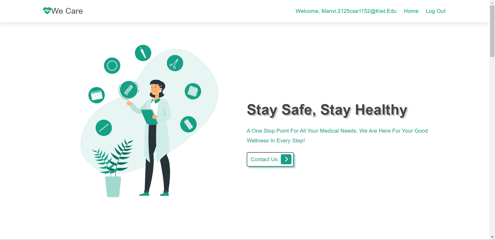

# 

## An website to help people in pandemic situations

# What problem it solves ?

We know in pandemic situations there is a great problem to reach out to things such as to doctor for
appointment, check the availability of vaccines near to our locality and also to reach at blood donation
camps. So we have a solution to problem. Our website `We Care` provides a one point solution to our all medical
needs.

### Features of our Website are :

- Bed Booking
- Doctor's Appointment
- Blood donors
- Ambulances Booking
  -AR Anatomy
- AR Based health Education

## How it work ?

- User open the website and register in the website
  see the home page

# 

# 

## Technologies used

- Node js
- HTML
- CSS
- JavaScript
- MongoDB

## Setup Instructions

#### Clone the repo in your local system

- `git clone https://github.com/SmitaTripathi/WE_CARE_`

#### add env file that require following things

- `MONGO_URI=' mongodb+srv://<username><password>@cluster0.jqzobx2.mongodb.net/)<collection>?retryWrites=true&w=majority'`
- `USER_NAME= " "` email id to send email by nodemailer
- `USER_PASSWORD= " "` password

#### Install node Modules

- `npm install`

#### Start the project

- `npm start`

## Team :

- [Manvi Jain](github.com/ManviJain24)
- [Smita Tripathi](github.com/SmitaTripathi)
- [Kushagra Varshney](github.com/KushagraVarshney05)
- [Yash Varshney](github.com/Yash-Var)
