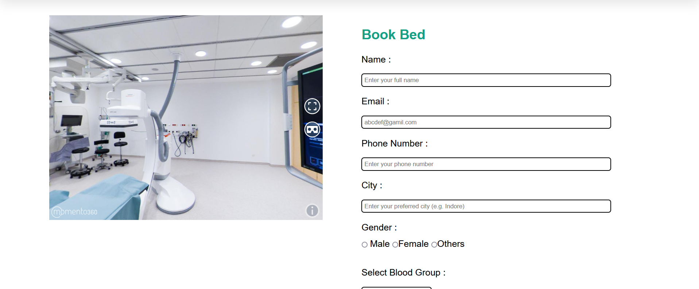
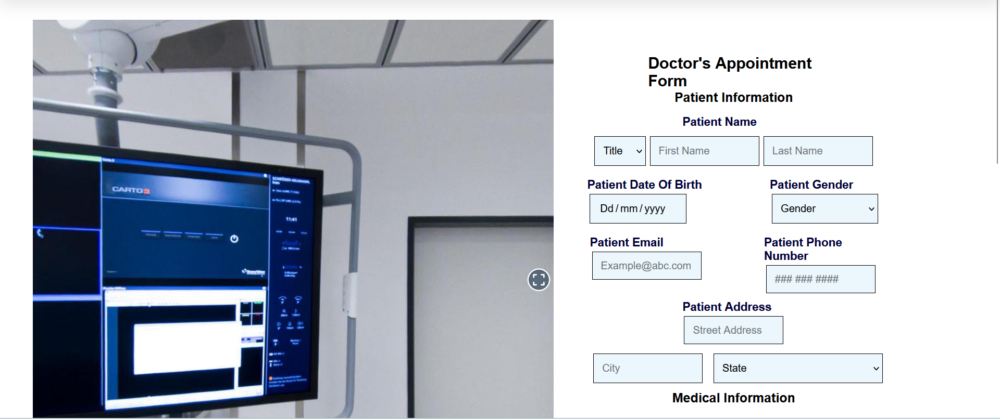
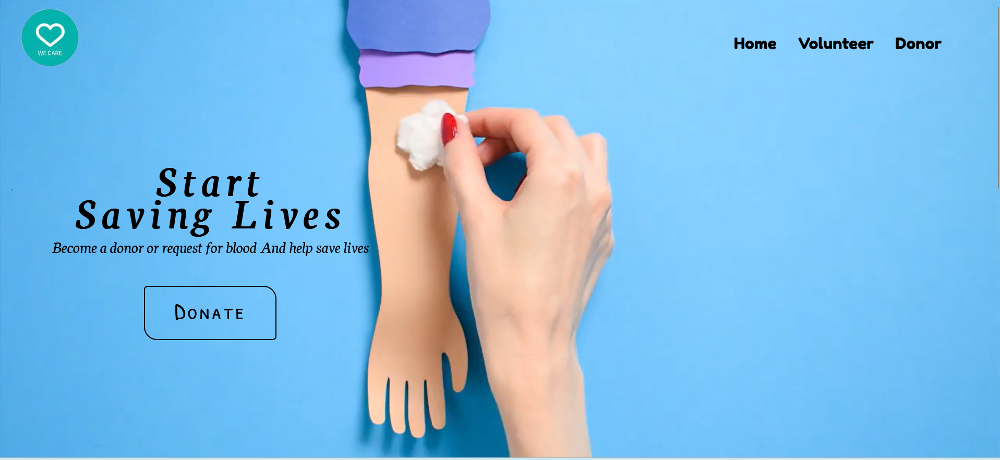
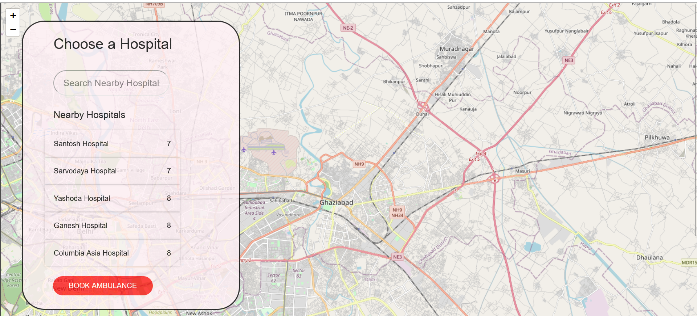
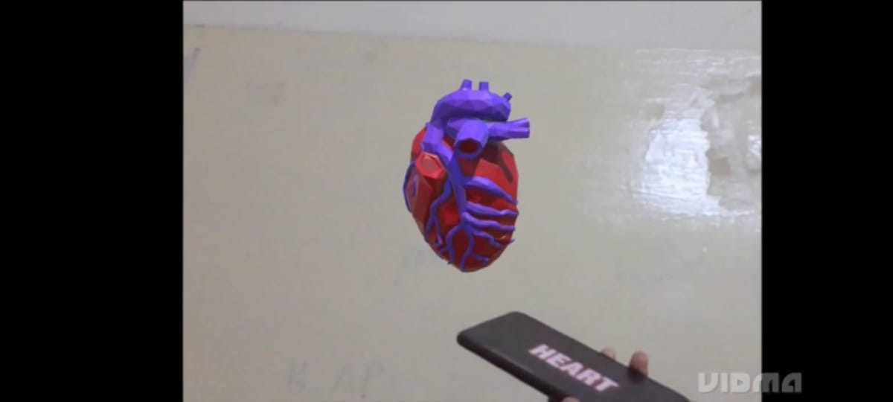

# 

## An website to help people in pandemic situations

# What problem it solves ?

We know in pandemic situations there is a great problem to reach out to things such as to doctor for
appointment, check the availability of vaccines near to our locality and also to reach at blood donation
camps. So we have a solution to problem. Our website `We Care` provides a one point solution to our all medical
needs.

### Features of our Website are :

- ## Hospital Bed Booking

- ## Doctor's Appointment

- ## Blood donors

- ## Ambulances Booking

- ## AR Anatomy

- ## AR Based health Education

## How it work ?

- User open the website and register in the website
  see the home page

# 

# 

## Technologies used

- Node js
- HTML
- CSS
- JavaScript
- MongoDB
- Unity 2021
- Vuforia
- C#
- 3D models

## Setup Instructions for Website

#### Clone the repo in your local system

- `git clone https://github.com/SmitaTripathi/WE_CARE_`

#### add env file that require following things

- `MONGO_URI=' mongodb+srv://<username><password>@cluster0.jqzobx2.mongodb.net/)<collection>?retryWrites=true&w=majority'`
- `USER_NAME= " "` email id to send email by nodemailer
- `USER_PASSWORD= " "` password

#### Install node Modules

- `npm install`

#### Start the project

- `npm start`

## Setup Instructions for AR
 - Install unity 2021 version
- Open vuforia portal and download it. 
- Sign up yourself in vuforia then login 
- Click on the license manager ,add a licence name, a key will be generated click on it 
It will be copied automatically. 
- Then click on target manager then create your target image (make sure target image is 4 to 5 star  and in jpg Or png version only) 
- Then select the target image and download the database. 
- Now move to your unity platform. 
- Then make sure you update your version. 
- Now import the package
  a) firstly vuforia 
  b) then the target image 
- Now import the files from the my folder AR 
 Start with any one, the process is same for others too. 
- Make sure you to add the key which is to be done on clicking on the AR camera open the vuforia configuration then add the key. 
- Then enter into the playzone area. 
- Present the image in front of the camera you will be able to see the 3D model.
 
## Team :

- [Manvi Jain](https://github.com/ManviJain24)
- [Smita Tripathi](https://github.com/SmitaTripathi)
- [Kushagra Varshney](https://github.com/KushagraVarshney05)
- [Yash Varshney](https://github.com/Yash-Var)
